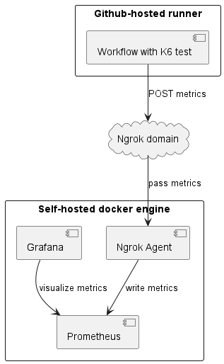

# Introduction

This repository contains infrastructure as a code solution able to deploy Prometheus, Grafana and Ngrok containers enabled for K6 remote write. The goal is to provide a simple way to deploy a self-hosted environment for K6 performance tests triggered from anywhere (locally or by cloud-hosted CI solution). Important piece of this solution is Ngrok, which allows to expose Prometheus instance to the internet, even if host is behind ISP gateway and cannot leverage port forwarding.



# Deployment

## Prerequisites

You will need Ngrok account and auth token. You can create free account [here](https://dashboard.ngrok.com/signup). The token can be found [here](https://dashboard.ngrok.com/get-started/your-authtoken). The domain can be set up [here](https://dashboard.ngrok.com/cloud-edge/domains).

The `scripts` directory contains 4 Bash scripts that can be used to deploy and clean up the configuration after deployment.

## Deployment guide:
1. Install npm bcrypt-cli package (used for password encryption):
```npm install -g bcrypt-cli```
1. Execute ```1-create-volumes.sh``` script to create volumes for Prometheus and Grafana containers.
1. Execute ```2-setup-secrets.sh``` script and provide passwords for Prometheus and Grafana users, along with Ngrok auth token and domain address. The script will encrypt user passwords with bcrypt and update configuration files. Those files will then be used to deploy Prometheus and Grafana containers.
1. Execute ```3-deploy.sh``` script to deploy Prometheus, Grafana and Ngrok containers.
1. Execute ```4-clean-up-secrets.sh``` script to revert deployment files changes and clean up secrets.

Destroy containers and volumes with `docker compose down prometheus grafana ngrok` command.

## Prometheus configuration

During secrets setup, Prometheus configuration file will be updated with basic authentication credentials for following users:
1. admin - used to authenticate into Prometheus dashboard.
1. remote-write - used by K6 to send metrics to Prometheus.
1. admin - used to authenticate into Grafana instance.

# Grafana dashboard creation

[Import](http://localhost:3000/dashboard/import) one of the dashboards below: 
- 19665 - [k6 Prometheus dashboard by Grafana k6](https://grafana.com/grafana/dashboards/19665-k6-prometheus/)
- 18030 - [k6 Prometheus (Native Histograms) dashboard by Grafana k6](https://grafana.com/grafana/dashboards/18030-k6-prometheus-native-histograms/)

[Dashboards source](https://k6.io/docs/results-output/real-time/prometheus-remote-write/#time-series-visualization)

After selecting dashboard id use provisioned Prometheus data source.

# Execute K6 test

Before executing K6 test, set the following environment variables:
```powershell
$env:K6_PROMETHEUS_RW_SERVER_URL="https://<ngrok-domain>/api/v1/write"
$env:K6_PROMETHEUS_RW_USERNAME="remote-write"
$env:K6_PROMETHEUS_RW_PASSWORD="<plain-text-password>"
```

Execute K6 test. Log should show that metrics are being sent to Prometheus.
```
output: Prometheus remote write (https://.../api/v1/write)
```

[Prometheus remote write documentation link](https://k6.io/docs/results-output/real-time/prometheus-remote-write/)